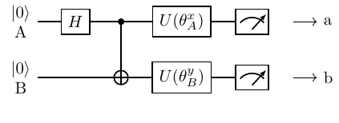
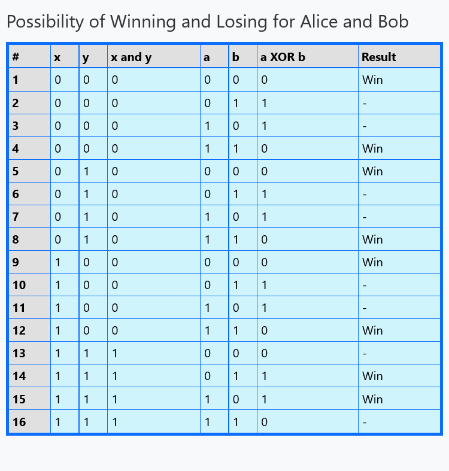

# CSHS Inequality Game

In the CSHS inequality game, Alice and Bob aim to violate the Clauser-Horne-Shimony-Holt (CHSH) Bell inequality by collaborating on a non-local strategy. The game involves a referee who sends each player one of two possible questions, denoted by x and y. Based on their questions, Alice and Bob each respond with one of two possible answers, denoted by a and b. The goal is to maximize the correlation between their answers, subject to the constraint that their responses must be independent of the questions they receive.
Strategy

## Classical Strategy

A classical strategy refers to a strategy that can be explained by a local hidden variable theory, which means that the players' answers are predetermined by some shared information that is independent of the questions they receive. A classical strategy cannot achieve a success probability greater than 0.75.

An example of a classical strategy for the CSHS inequality game is:

1. Alice and Bob agree on a predetermined set of answers to give for each possible combination of questions they might receive.

2. During the game, Alice and Bob simply look up the answers in their shared table based on the questions they receive and provide those answers to the referee.

3. This strategy cannot achieve a success probability greater than 0.75, which means that it cannot violate the Bell inequality.

## Quantum Strategy

A quantum strategy refers to a strategy that involves the use of quantum entanglement between Alice and Bob's systems, which allows them to achieve a higher success probability than any classical strategy can achieve.

An example of a quantum strategy for the CSHS inequality game is:

1. Alice and Bob start with a shared entangled state, such as a singlet state. This means that the state of each particle in the entangled pair is not well-defined, but the states are correlated in a way that cannot be explained by classical physics.

2. When the referee sends them their questions, Alice and Bob perform a measurement on their respective particles that is dependent on their question. The measurement results in either a "0" or "1" outcome.

3. Alice and Bob compare their outcomes and win the game if the XOR of their answers is equal to the AND of their questions.

4. By using a carefully chosen entangled state and measurement strategy, Alice and Bob can achieve a success probability of 0.8535, which is higher than the maximum possible success probability for any classical strategy.

In this game, Alice and Bob prepare and share a Bell pair:

$|\Psi\rangle = \frac{|00\rangle + |11\rangle}{\sqrt{2}}$

Then, each one of them independently chooses a rotated measurement base, of the form: 

$\{ |u_{0}(\theta)\rangle, |u_{1}(\theta)\rangle \}$ 

with 

$|u_{0}(\theta)\rangle = \cos(\theta)|0\rangle + \sin(\theta)|1\rangle$

and 

$|u_{1}(\theta)\rangle = -\sin(\theta)|0\rangle + \cos(\theta)|1\rangle$

# Reference
Alice and Bob win the game when:

- If *either* received `0`, they send the *same* answer
- If *both* received `1`, they send *different* answers

Equivalently, they win iff `x and y == a + b (mod 2)`

# Conclusion

In summary, the CSHS inequality game is a simple yet powerful example of a non-local game that illustrates the difference between classical and quantum correlations. Through careful use of entanglement and measurement strategies, Alice and Bob can achieve a success probability that violates the Bell inequality and demonstrates the non-local nature of quantum mechanics.